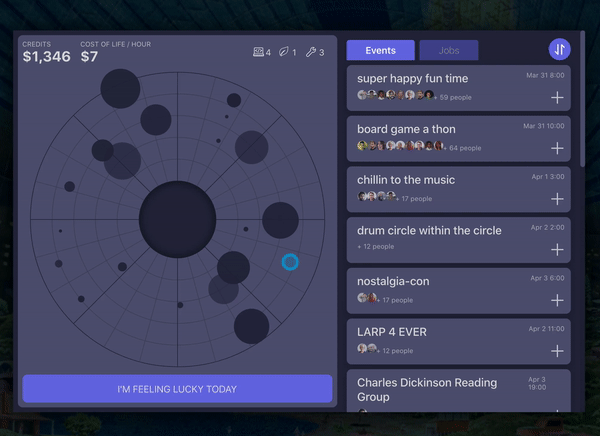
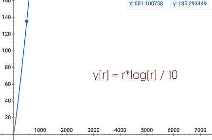
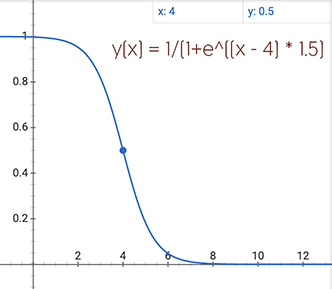

## Torus Town Event Dashboard
##### Author: Cora Wang
Last Updated: Sep 28, 2020

#### Introduction
This project contains 5 major modifications to the original project forked from Tulip/ux-engineer-takehome:
1. Show event details and attendees on click `+` button on an event card
2. Scroll to corresponding event card on click a corresponding circle on the donut chart
3. Map the size and transparency of donut circles to # of attendees and how far it is into the future. An event in the closer future has a higher opacity than the ones in the further future.
4. Add a sort button to the social event list as well as the job list.
5. Add a random event picker.

Design Mockups are available on [my figma space](https://www.figma.com/file/Q5DmD7AHTpYU6bnEeTUt1a/Torus-Takehome) 

###### note: I wrote most of the custom components on my own as I thought in order to demonstrate my ability as a UX engineer it might be better not to use packages for convenience.

#### Demo

#### Design Decisions
In Step 3 of the instruction, I used two non-linear functions to scale the circle radius and transparency.
The design thinking behind those non-linear functions is that, for plotting, we don't necessarily need to strictly 
follow the relative mathematical relationship between two data points. The idea is to clearly visualize the difference.
In reality, with plotting packages, this should be pretty easy :) 
1. For demonstration purpose, I used `r*log(r) / 10` to calculate the circle radius because our party events contain roughly 10 - 80 attendees. 
Such a transformation scales the final results in our pool into `r = 2.5 to 35`.
And it will be pretty ideal until it hits 500 people. If the party events we consider could potentially involve 500+ people, we need to adjust the scaling equation accordingly.

2. I used a reverse sigmoid model to plot transparency. 
The plan is to show the events in the nearest future with high opacity & events in further future with low opacity. 
A reverse sigmoid function 1/(1+e^x) scales number between -5 to 5 into a range of roughly 1-0. In our case, because the story happens in 2144,
 I "decide" today will be March 31st, 2144. So, the events are happening within 0 to 4 days. Thus, it is really 
convenient in our case to use a sigmoid function with a small amount of transformation. 
The final equation is `1/(1+e^((diff - 4) * 1.5)` , which scales to our dataset the best. 
Again, in reality, transformation can to adjust according to input range. Or, there are quite a few packages out there that allow us to do such a conversion.
The reason I made the calculation manually is just a sigmoid performs pretty ideal here!

3. I decided to use a random event picker instead of a timeline. To be very honest, one reason is simply for 
sake of time I've left. Since there is a time restriction, I felt like in the end, I might run in short of time if I decide to build a new timeline and 
link it to the donut chart as well as event list. It could become a `Torus-Town@2.0.0` feature! The other reason is that 
I feel like for an app like this, a random event picker sounds much more fun to users since they are very bored and are trying to look for a party to join. 
In this sense, a simple random event picker would fit into the Torus culture very well. 

#### Constraints and Future Improvements
1. As I mentioned in design decisions, I chose not to proceed with a master timeline because of time concerns. 
If we are going to develop this (for real!) in the future, this is definitely something we can deal with.

2. I only linked the donut char with the social event data list but not the job. It is again, a compromise due to time restriction — 
My random event picker probably fits perfectly with finding social events. But it would not help customers find a job! I believe no one will ever decide to find a random job based on a lottery result. 
I also think the circles on the donut chart might not be the best representation of jobs as it does not reveal any real information about the job (e.g. industry? type? credits?). 
To make the most sense, in future design iterations, we could color code the jobs by job industry, map the job coordinates according to how similar the job description is to the user,
 and lastly, incorporate the timeline to represent the latest start date.

3. I did not make much UI changes due to time concerns. It would be pretty fun to design for non-mouse interactions (e.g. interactions to substitute onHover behavior)
 and responsiveness. 
